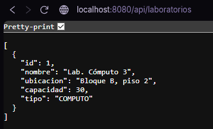
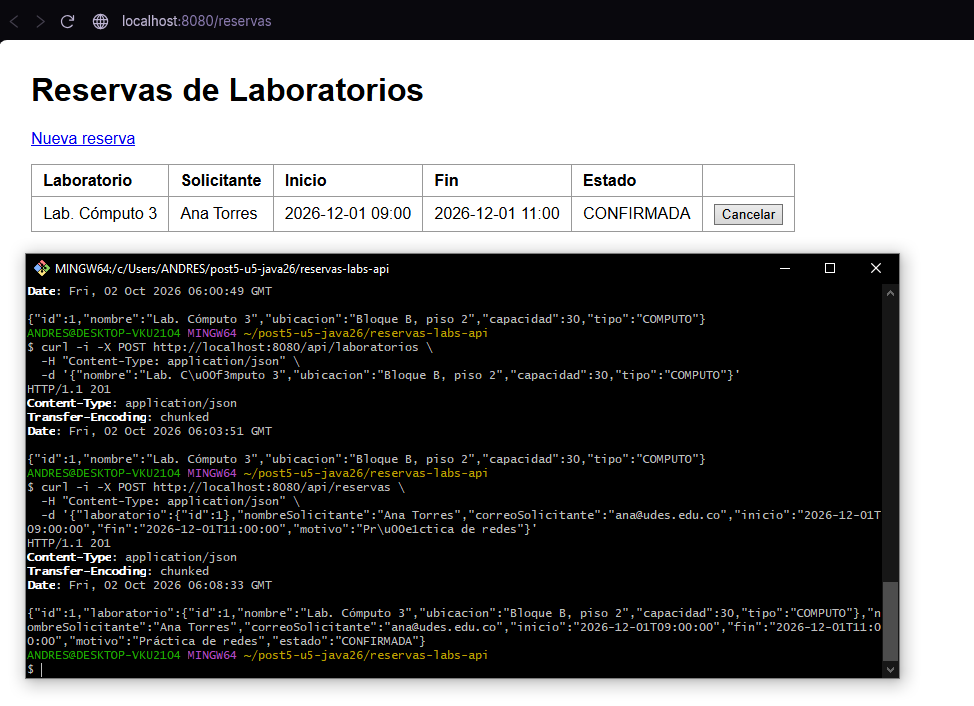
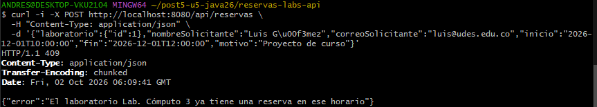
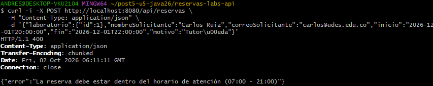
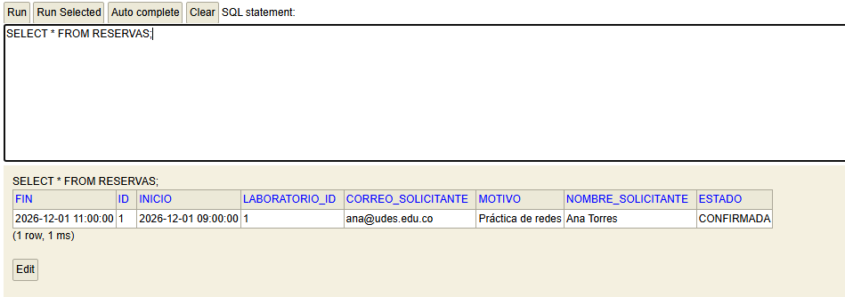
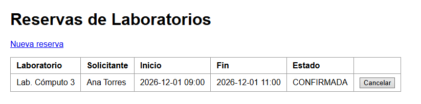
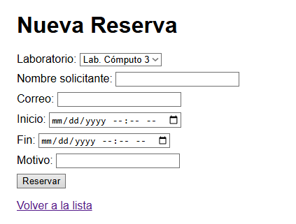
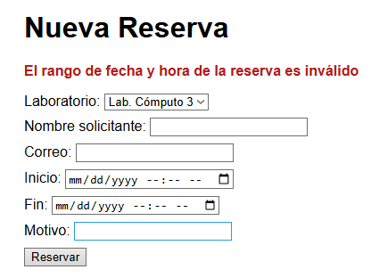
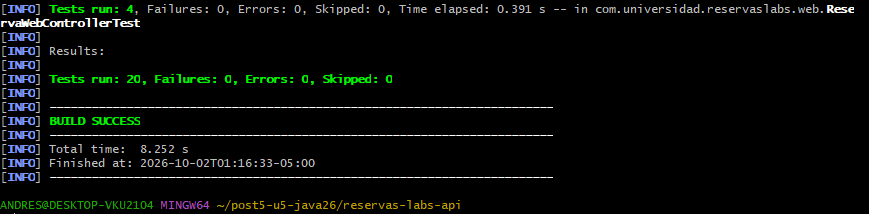

# Post-contenido, Unidad 5: Integración en Aplicaciones Web

Sistema de reservas de laboratorios de cómputo: arquitectura en capas y MVC + REST.

## Descripción

Repositorio del post-contenido de la Unidad 5 de Patrones de Diseño de Software. Un único
proyecto Spring Boot (`reservas-labs-api`) para la reserva de laboratorios de cómputo de la
universidad, con dos partes:

- **Parte 1:** API REST en capas (Entity, Repository, Service, Controller) sobre H2.
- **Parte 2:** vista Thymeleaf (MVC clásico) que reutiliza exactamente el mismo `ReservaService`.

## Arquitectura

```
Cliente REST (curl/Postman)        Navegador
          |                            |
 ReservaController             ReservaWebController
 (@RestController, JSON)       (@Controller, Thymeleaf)
          |                            |
          +-------- ReservaService ----+      <- reglas de negocio (un solo bean)
                        |
                ReservaRepository             <- consultas de datos (JPQL)
                        |
                     H2 (JPA)
```

| Paquete | Responsabilidad |
|---|---|
| `model/` | Entidades `Laboratorio`, `Reserva` y enum `EstadoReserva` |
| `repository/` | `LaboratorioRepository` y `ReservaRepository` (con la consulta `buscarSolapamientos`) |
| `service/` | `ReservaService`: solapamiento, horario, duración y reglas de cancelación |
| `exception/` | Excepciones de dominio y `GlobalRestExceptionHandler` (presentación JSON) |
| `controller/` | `ReservaController` y `LaboratorioController` (API REST) |
| `web/` | `ReservaWebController` y `ReservaWebExceptionHandler` (presentación HTML) |

## Parte 1: Repository, Service y Controller REST

`LaboratorioRepository` y `ReservaRepository` extienden `JpaRepository`; `ReservaRepository`
agrega una consulta JPQL propia para detectar solapamientos de horario. `ReservaService`
concentra las reglas de negocio (solapamiento, horario de atención, duración, misma fecha,
fechas pasadas y cancelación). `ReservaController` y `LaboratorioController` exponen
`/api/reservas` y `/api/laboratorios`.

## Parte 2: Vista MVC con Thymeleaf

`ReservaWebController` expone `/reservas` con Thymeleaf, inyectando la **misma** instancia de
`ReservaService` que usa la API REST, sin Service duplicado. `ReservaWebExceptionHandler` maneja
las mismas excepciones de dominio que `GlobalRestExceptionHandler`, con otra presentación
(redirección con mensaje en vez de JSON). Ver el paquete `web/` y `templates/reservas/`.

## Cómo ejecutar

Requisitos: Java 17 a 26 (desarrollado con Java 26) y Maven 3.9+.

```
$ mvn clean package
$ mvn spring-boot:run
```

- API REST: http://localhost:8080/api/reservas
- Vista MVC: http://localhost:8080/reservas
- Consola H2: http://localhost:8080/h2-console (JDBC URL `jdbc:h2:mem:reservas_labs_db`, usuario `sa`, sin contraseña)

`mvn test` ejecuta 20 pruebas: reglas del Service, códigos HTTP de la API y comportamiento de
la vista Thymeleaf.

### Endpoints REST

| Método | Ruta | Respuesta |
|---|---|---|
| GET | `/api/laboratorios` | Lista de laboratorios |
| GET | `/api/laboratorios/{id}` | 200 o 404 |
| POST | `/api/laboratorios` | 201, o 400 si falta un campo |
| GET | `/api/reservas` | Lista de reservas |
| GET | `/api/reservas/{id}` | 200 o 404 |
| GET | `/api/reservas/laboratorio/{laboratorioId}` | Reservas de un laboratorio |
| POST | `/api/reservas` | 201; 409 si se solapa; 400 si viola horario, duración o un campo; 404 si el laboratorio no existe |
| DELETE | `/api/reservas/{id}` | 204; 409 si ya inició o ya estaba cancelada; 404 si no existe |

### Rutas MVC

| Método | Ruta | Vista |
|---|---|---|
| GET | `/reservas` | `reservas/lista.html` |
| GET | `/reservas/nueva` | `reservas/nueva.html` |
| POST | `/reservas` | Crea y redirige a la lista, o vuelve al formulario con el error |
| POST | `/reservas/{id}/cancelar` | Cancela y redirige a la lista |

## Decisiones de diseño

### Punto de decisión 1: ubicación de la validación de solapamiento

La validación se divide en dos responsabilidades. `ReservaRepository.buscarSolapamientos`
responde una **pregunta de datos**: "¿qué reservas activas de este laboratorio se cruzan con
este rango?". El filtrado ocurre en la base de datos con la condición `r.inicio < :fin AND
r.fin > :inicio`, de modo que nunca se traen a memoria todas las reservas del laboratorio,
que crecen sin límite con el tiempo. La alternativa descartada (un `findByLaboratorioId` y
comparar rangos en Java dentro del Service) funciona igual con diez reservas, pero con miles
transfiere y recorre filas que en su mayoría no importan.

`ReservaService.crear` responde la **pregunta de negocio**: "¿se permite esta reserva?". Es
quien decide que una lista no vacía significa rechazo y lanza `ReservaConflictException` con
un mensaje legible. El Repository nunca lanza excepciones de negocio.

Si el Controller llamara directamente a `buscarSolapamientos()`, la regla quedaría escrita en
la capa HTTP: la vista Thymeleaf tendría que repetirla, y cualquier nuevo punto de entrada que
olvidara la llamada permitiría crear reservas solapadas sin que nada lo impidiera.

Los rangos son semiabiertos: una reserva de 9:00 a 10:00 y otra de 10:00 a 11:00 no chocan,
cubierto por la prueba `reservasContiguasNoSeConsideranSolapadas`.

### Punto de decisión 2: reglas con y sin apoyo del Repository

El criterio general: **si la regla necesita comparar contra datos que solo la base conoce**
(otras reservas existentes), se apoya en una consulta del Repository; **si depende únicamente
del objeto que se valida**, se resuelve en el Service con Java puro, sin tocar la base.

Por eso `validarHorarioYDuracion` vive entera en `ReservaService`: horario de atención
(07:00 a 21:00), duración (30 minutos a 3 horas), misma fecha de inicio y fin, y que la
reserva no esté en el pasado. Ninguna consulta otra fila, y consultar la base para ellas solo
agregaría latencia. Además se evalúan **antes** del solapamiento: una reserva malformada se
rechaza sin gastar una consulta.

Al revisar esta regla se encontró un defecto en el código de la guía: solo comparaba la hora
del inicio contra la apertura y la hora del fin contra el cierre, así que una reserva de 22:30
a 01:00 del día siguiente pasaba la validación (dura 2,5 horas, 22:30 no es antes de las 07:00
y 01:00 no es después de las 21:00). Se agregó la regla "misma fecha", cubierta por la prueba
`reservaQueCruzaLaMedianocheEsInvalida`.

### Punto de decisión 3: cómo comparten Service el controlador MVC y el REST

Ambos reciben por constructor la misma clase `ReservaService`, que Spring administra como un
único bean singleton:

- [`ReservaController.java`, líneas 15 a 18](src/main/java/com/universidad/reservaslabs/controller/ReservaController.java#L15-L18)
- [`ReservaWebController.java`, líneas 22 a 26](src/main/java/com/universidad/reservaslabs/web/ReservaWebController.java#L22-L26)

Ninguno reimplementa la validación. La alternativa descartada (copiar las reglas dentro de
`ReservaWebController`, o crear un `ReservaWebService` casi idéntico) obligaría a corregir la
regla de solapamiento o la de horario en dos lugares; el defecto de la medianoche descrito en
el punto 2 habría tenido que arreglarse dos veces, con el riesgo de que una superficie quedara
corregida y la otra no. La prueba `solapamientoMuestraElMismoMensajeQueLaApiRest` confirma que
la vista produce exactamente el mismo mensaje de negocio que la API.

`ReservaWebController` sí inyecta `LaboratorioRepository`, pero solo para llenar el combo de
laboratorios del formulario: es una lectura del catálogo, no una regla de negocio.

### Punto de decisión 4: manejo de errores consistente entre MVC y REST

Se usan dos manejadores, cada uno restringido a su superficie:

- `GlobalRestExceptionHandler`, con `@RestControllerAdvice(annotations = RestController.class)`,
  responde JSON con código de estado.
- `ReservaWebExceptionHandler`, con `@ControllerAdvice(assignableTypes = ReservaWebController.class)`,
  redirige con el mensaje como atributo flash.

Un `@RestControllerAdvice` siempre serializa a JSON, y una página Thymeleaf necesita una
redirección con texto legible. La alternativa de un único manejador que inspeccione el header
`Accept` para decidir el formato es posible, pero agrega una rama condicional por cada
excepción y mezcla dos presentaciones en una clase. Con dos manejadores, cada superficie tiene
su propia clase de presentación y ambas parten del mismo vocabulario de excepciones de dominio:

| Excepción | Significado | REST | Vista MVC |
|---|---|---|---|
| `ReservaConflictException` | Choca con el estado actual (solapamiento, ya iniciada, ya cancelada) | 409 + JSON | Redirección con mensaje |
| `ReservaInvalidaException` | Datos de la reserva inválidos por sí mismos (horario, duración, fechas) | 400 + JSON | Redirección al formulario |
| `RecursoNoEncontradoException` | Laboratorio o reserva inexistente | 404 + JSON | Redirección a la lista |

Un detalle adicional: el manejador web envía un conflicto de **cancelación** a la lista (donde
está el botón que lo provocó) y un conflicto de **creación** al formulario. Con un único
destino fijo, un error al cancelar desde la lista habría llevado al usuario al formulario de
nueva reserva.

### Decisiones adicionales y correcciones a la guía

- **Spring Boot 4.1.1 en lugar de 3.2.x.** El proyecto se desarrolla con Java 26 y Maven 3.9.
  Spring Boot 3.2 solo soporta hasta Java 21: con Java 26 falla Lombok al compilar y Byte
  Buddy (que usa Hibernate) al arrancar. La línea 4.1 es la primera con soporte oficial para
  Java 26 y ya gestiona versiones compatibles (Lombok 1.18.46, Byte Buddy 1.18.11,
  Hibernate 7.4). El código de capas no cambió; solo cambiaron tres nombres de Boot 4:
  `spring-boot-starter-web` ahora es `spring-boot-starter-webmvc`, la consola H2 vive en el
  módulo `spring-boot-h2console`, y `@AutoConfigureMockMvc` se importa desde
  `org.springframework.boot.webmvc.test.autoconfigure`. El `java.version` sigue en 17 a
  propósito: es el nivel mínimo del bytecode generado, no la versión instalada, así que el
  proyecto compila con Java 26 y también corre en cualquier Java de 17 en adelante.
- **400 frente a 409.** El código de la guía lanzaba `ReservaConflictException` tanto para un
  solapamiento como para una reserva fuera de horario, así que ambos casos respondían 409,
  aunque el checkpoint del Paso 9 exige 400 para el horario. Se agregó `ReservaInvalidaException`
  (400): un horario inválido es un error de los datos enviados, mientras que un solapamiento es
  un conflicto con el estado del sistema.
- **Fechas en el formulario.** El campo `datetime-local` del navegador envía `2026-12-01T09:00`.
  Sin `spring.mvc.format.date-time=iso`, el binding de `@ModelAttribute` no sabe convertir ese
  texto a `LocalDateTime`.
- **Validación del formulario.** Se agregó `@Valid` con `BindingResult` en
  `ReservaWebController.crear`. Sin ello, un nombre vacío llegaba hasta el `persist` y terminaba
  en un error 500; ahora el formulario se vuelve a mostrar con los datos digitados y el error.
- **Correo obligatorio.** `@Email` acepta `null`, y la columna es `NOT NULL`; se agregó
  `@NotBlank` para que un correo vacío dé 400 y no un error de base de datos.
- **Reglas extra del Service.** No se reserva en el pasado y no se cancela dos veces la misma
  reserva. Ambas refuerzan que `ReservaService` no es un passthrough del Repository.
- **Paquete de la clase principal.** `ReservasLabsApiApplication` vive en
  `com.universidad.reservaslabs`. Spring Initializr, con Group `com.universidad.reservaslabs` y
  Artifact `reservas-labs-api`, propone por defecto el paquete
  `com.universidad.reservaslabs.reservaslabsapi`; con esa ubicación el escaneo de componentes
  no encontraría `model/`, `service/` ni `controller/`.

### Nota sobre LaboratorioController

`LaboratorioController` es la única excepción intencional a "el Controller nunca toca el
Repository": el catálogo es un CRUD sin reglas propias, y un `LaboratorioService` que solo
delegue sería el antipatrón de Service anémico. La capa de servicio se introduce cuando una
regla la justifica, no por plantilla. `LaboratorioRepository.existsByNombreIgnoreCase` queda
declarado sin uso: el día que el catálogo exija nombres únicos, esa regla será la razón para
crear `LaboratorioService`.

### Limitación conocida: concurrencia

La verificación de solapamiento y el `save` ocurren en la misma transacción, pero dos
peticiones simultáneas para el mismo horario podrían pasar ambas la consulta antes de que
cualquiera guarde. Para un laboratorio académico el riesgo es bajo; en producción se cerraría
con un bloqueo pesimista sobre el laboratorio (`@Lock(PESSIMISTIC_WRITE)`) o con una
restricción de exclusión en la base de datos.

## Evidencias - Capturas de pantalla

### API REST







### Vista Thymeleaf





### Pruebas



## Herramientas utilizadas

- Java 26, Spring Boot 4.1.1, Spring Data JPA, Hibernate 7, H2, Thymeleaf, Lombok
- Apache Maven 3.9, JUnit, MockMvc, curl, Git, GitHub

## Conclusiones

La parte más difícil no fue escribir las reglas, sino decidir dónde debía vivir cada una. La
pregunta que ordenó todo fue "¿esta regla necesita conocer otras filas?": si la respuesta es sí,
el Repository filtra y el Service decide; si es no, basta Java puro en el Service. Haber
concentrado las reglas en un solo `ReservaService` se pagó solo en la Parte 2: la vista
Thymeleaf obtuvo el solapamiento, el horario y la duración sin escribir una línea de validación,
y el defecto de la medianoche se corrigió una sola vez para ambas superficies. También quedó
claro que separar capas no significa crear capas vacías: `LaboratorioController` usa el
Repository directamente porque no hay regla que justifique un Service, y esa decisión se revisa
el día que aparezca una.
